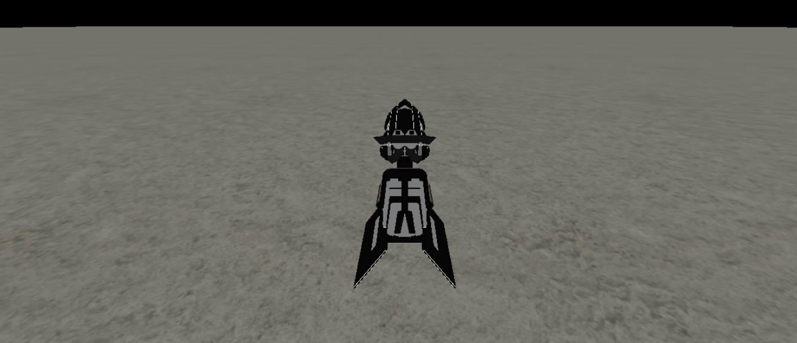

# Three js and Cannon js land speeder

## About

The project involves creating a land speeder using Three.js for rendering and Cannon.js for physics. It also users a land speeder gltf model.



### Cannon js

```js
function initCannon() {
  timestep = 1 / 60;
  // create a cannon world with gravity in x axis
  world = new CANNON.World({
    gravity: new CANNON.Vec3(0, -9.81, 0),
  });
  // create cannon materials for thcannon body
  const boxPhysMaterial = new CANNON.Material();
  const groundPhysMaterial = new CANNON.Material();

  // Create behaviour of contact between plane and box
  const groundBoxContactMat = new CANNON.ContactMaterial(
    boxPhysMaterial,
    groundPhysMaterial,
    {
      restitution: 0.1,
    }
  );

  world.addContactMaterial(groundBoxContactMat);

  // create body for the plane
  groundBody = new CANNON.Body({
    mass: 0,
    shape: new CANNON.Plane(),
    material: groundPhysMaterial,
  });
  world.addBody(groundBody);
  groundBody.quaternion.setFromAxisAngle(
    new CANNON.Vec3(1, 0, 0),
    -Math.PI / 2
  );

  // create body for box to control position and rotation of model
  boxBody = new CANNON.Body({
    mass: 500,
    shape: new CANNON.Box(new CANNON.Vec3(2, 1.5, 3)),
    position: new CANNON.Vec3(0, 10, 0),
    material: boxPhysMaterial,
  });

  world.addBody(boxBody);
  cannonDebugger = new CannonDebugger(scene, world, {
    color: 0x0000ff,
  });
}
```

### THREE.js

```js
// add plane with texture
const planeGeometry = new THREE.PlaneGeometry(1000, 1000, 64, 64);
const planeMaterial = new THREE.MeshStandardMaterial({
  map: texture, //add color map
  displacementMap: displacementMap, //add displacement
  displacementScale: 1,
  aoMap: arm,
  roughnessMap: arm,
});
// add model
const loader = new GLTFLoader();
loader.load("./assets/models/speeder.gltf", function (gltf) {
  speederModel = gltf.scene;
  speederModel.scale.set(0.02, 0.02, 0.02);
  speederModel.position.copy(boxBody.position);
  speederModel.quaternion.copy(boxBody.quaternion);

  speederModel.add(chaseCam);
  scene.add(speederModel);
});
// Add sound
const listener = new THREE.AudioListener();
camera.add(listener);

soundSpeeder = new THREE.Audio(listener);

const audioLoader = new THREE.AudioLoader();
audioLoader.load("./assets/sounds/aud.mp3", function (buffer) {
  soundSpeeder.setBuffer(buffer);
  soundSpeeder.setLoop(true);
  soundSpeeder.setVolume(0.5);
});
// Add controls
document.onkeydown = (event) => {
  switch (event.key) {
    case "w":
      speed += acceleration;
      if (speed > maxSpeed) speed = maxSpeed;
      if (!soundSpeeder.isPlaying) soundSpeeder.play(); //play sound
      break;
    case "s":
      speed -= acceleration;
      if (speed < 0) {
        speed = 0;
      }
      if (speed === 0) {
        if (soundSpeeder.isPlaying) soundSpeeder.stop(); //stop sund
      }
      break;
    case "a":
      angle += Math.PI / 180;
      break;
    case "d":
      angle -= Math.PI / 180;
      break;
  }
  // use cannon to control rotation
  boxBody.quaternion.setFromAxisAngle(new CANNON.Vec3(0, 1, 0), angle);
};
// Use third person camera
function initChaseCam() {
  chaseCam = new THREE.Object3D();
  chaseCam.position.set(0, 0, 0);

  chaseCamPivot = new THREE.Object3D();
  chaseCam.position.set(0, 200, -300);

  chaseCam.add(chaseCamPivot);
  scene.add(chaseCam);
}
```
